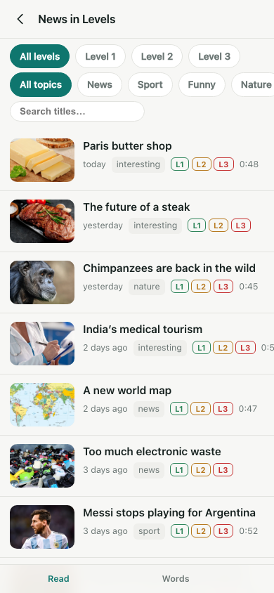
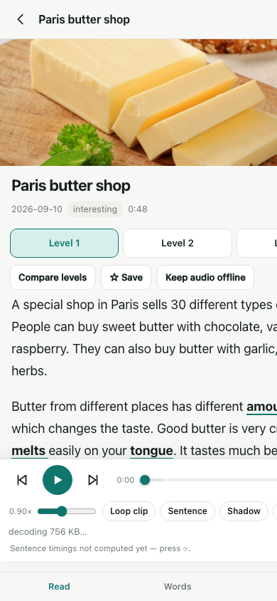
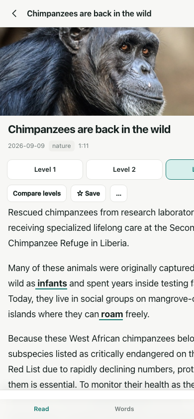

# News in Levels — reader

A self-hosted reading + listening app for [newsinlevels.com](https://www.newsinlevels.com/),
built because the official free app is awkward. It keeps the newest ~150 stories
(three levels each), plays the real audio, and adds the thing that actually helps
when you're learning: **per-sentence audio control** — tap a sentence to hear it,
loop one sentence, or shadow it out loud.

No server, no build step, no dependencies. It runs as a PWA from GitHub Pages.

| Reading list | Story + player | Level 3 with sentence timings |
|---|---|---|
|  |  |  |

<p align="center"><em>Read · listen · loop one sentence · shadow · keep a word list</em></p>

---

## What it does

**Listening**
- 0.5×–1.5× speed, remembered as your default
- **Whole-clip loop** for passive listening
- **A–B loop** — drop two markers on the scrub bar and loop that exact span
- **Per-sentence loop** — loop just the sentence you're stuck on
- **Shadowing mode** — plays a sentence, goes quiet so you can repeat it out loud, plays it again, then moves on (repeats and gap length are configurable)
- **Tap any sentence in the text** to jump the audio there
- Background playback with lock-screen / notification controls (Media Session)

**Reading**
- Switch between Level 1 / 2 / 3 instantly, or put all three side by side
- Difficult words are highlighted — tap one for its definition, add it to your word list
- Reading position, font size, light/dark/auto theme

**Keeping track**
- Saved stories, word list with a day streak, continue-reading history
- Offline: the app shell always works offline, and any clip you tap *Keep audio offline* plays with no network

---

## Quick start (local)

```bash
cd scraper && pip install -r requirements.txt   # nothing outside the stdlib
python scraper/sync.py --window 150             # ~3 min, writes docs/data/
cd docs && python3 -m http.server 8000
# open http://localhost:8000
```

At this point audio plays through the public SoundCloud podcast feed, but
sentence looping and tap-to-seek are switched off — see the next section for why.

---

## Deploy

### 1. The app (GitHub Pages)

```bash
git init && git add -A && git commit -m "initial"
git remote add origin git@github.com:<you>/<repo>.git
git push -u origin main
```

Then **Settings → Pages → Source: Deploy from a branch → `main` / `/docs`**.

The daily workflow in `.github/workflows/sync.yml` refreshes the story window
each morning (~1 min once the committed raw cache is warm) and commits the result.

### 2. The audio resolver (Cloudflare, free)

**给中国大陆用户：用 Pages 部署，不要用 Workers。** 实测（大陆家宽，无代理）：

| 主机 | 结果 |
|---|---|
| `aotemj.github.io` | ✅ HTTP 200 |
| `nil-audio.<sub>.workers.dev` | ❌ 超时 —— DNS 被污染，解析到 `192.133.77.59`（Twitter 地址段） |
| `*.pages.dev` | ✅ 可达（`cloudflare-pages.pages.dev` → 真实 Cloudflare IP + HTTP 522） |
| `api-v2.soundcloud.com` | ❌ 超时 —— 污染为 Dropbox / Facebook 地址 |
| `feeds.soundcloud.com` | ❌ 超时 |
| `cf-media.sndcdn.com` | ⚠️ **能握手但拿不到音频** —— 见下 |

被墙的是 **Worker 自己的域名** 和 **SoundCloud 的 API/feed**，所以"解析"这一步在客户端做不了，
必须放在 Worker 侧。`pages.dev` 和 `workers.dev` 同为 Cloudflare，但只有前者没被污染，而
Pages Functions 跑的就是同一套 Worker 运行时 —— 所以搬到 Pages 即可，零成本、不用买域名。

**音频字节也必须经 Worker 转发（`/stream`），不能靠 302 让客户端自己去取。** 这一条是被实测
推翻后的修正（早先曾据 `cf-media` 返回 403 而误判为"可达且正常"）：

| 证据 | 结果 |
|---|---|
| 签名地址本身 | **有效** —— 由 Cloudflare 侧取同一个 URL 得 `206` + `audio/mpeg` + ID3 |
| 客户端直连该 URL | **403**，响应体是 10 字节纯文本 `Forbidden` |
| TLS 证书 | `CN=*.sndcdn.com` / `Amazon RSA 2048 M01`，`Verify return code: 0` → **没有被中间人劫持** |
| 响应头 | `server: AmazonS3`、`x-cache: Error from cloudfront`、`age: 52887`、`x-amz-cf-pop: LAX54-P3` |

也就是说：签名的有效期没问题（实测还剩 172 秒），音频也确实存在，但**客户端这条网络路径拿到的是
CloudFront 边缘缓存下来的错误对象**（一个 2016 年的 10 字节 S3 占位文件）。同一个 URL 从 Cloudflare
取就是正常音频 —— 差别只在网络路径。所以默认走 `/stream`（Worker 转发字节、转发 `Range`），
`/audio`（302）降级为备选。

```bash
npx wrangler login          # 一次性
npx wrangler pages deploy   # 一般不需要手敲，见下
```

部署到 `https://nil-audio.pages.dev`：静态资源来自 `docs/`，解析器由 `functions/` 挂载在
`/audio/<id>`、`/stream/<id>`、`/health`。把该 URL 填进 `docs/config.js` 的
`WORKER_BASES[0]`，或在 App 的 setup 面板里粘贴。

#### 自动部署（不用再手敲那条命令）

**Cloudflare 的 Git 集成负责部署** —— Pages 项目连上本仓库后，推送到 main 就会自动构建并发布，
**包括每日同步的数据提交**，而且不需要任何 token。

Pages 项目的构建配置必须是（这是踩过的坑）：

| 字段 | 值 |
|---|---|
| Framework preset | **None** |
| Build command | **留空** |
| **Build output directory** | **`docs`** |
| Root directory | `/` |
| （若有）**Deploy command** | **`npx wrangler pages deploy`** |

> **不要把 Deploy command 填成 `npx wrangler deploy`** —— 那是 Workers 的命令，Pages 项目会
> 在构建日志里这样失败（wrangler 自己也会先警告）：
> `▲ [WARNING] It seems that you have run `wrangler deploy` on a Pages project`
> `✘ [ERROR] Missing entry-point to Worker script or to assets directory`
> `functions/` 目录由 Pages 自动识别，不需要配置。

#### 部署校验（不需要任何凭据）

`.github/workflows/verify-pages.yml` 在推送后轮询线上 `/version.json`，直到它与仓库里
`docs/config.js` 的 `BUILD` 一致才判定成功 —— 因为"构建日志是绿的"和"站点真的换版了"是两件事，
**静默失败的部署看起来和成功一模一样**（这个坑本项目真吃过一次）。

`sync.yml` 也会调用它：每日同步是用默认 `GITHUB_TOKEN` 提交的，而 GitHub **不允许**这种提交
触发其它 workflow，所以不显式调用的话，Cloudflare 那边的构建悄悄失败也不会有人知道。

> 想改回"由 GitHub Action 部署"也可以：需要 `CLOUDFLARE_API_TOKEN`（Custom token，权限
> **Account → Cloudflare Pages → Edit**）和 `CLOUDFLARE_ACCOUNT_ID` 两个 Secret。用 Git 集成
> 就不用折腾这些。

改完 workflow 本地就能验证，不必等 Actions 变红：

```bash
python tools/check_workflows.py     # YAML、uses: 指向、构建号一致性
python tools/check_cloudflare_token.sh   # 只在你要用 token 部署时才需要
```


> Worker 的部署方式仍然保留（`cd worker && npx wrangler deploy`）——两者共用
> `worker/index.js` 同一份实现。App 会按 base × mode 顺序逐个尝试（列表见 `config.js` 的
> `WORKER_BASES` 与 `AUDIO_MODE`），任何一个不可用都只会浪费一次尝试，不会让播放器死掉。

#### 怎么知道手机上跑的是哪一版

打开 **setup**，标题右边就是构建号（`nil-v6` 这种）；也可以按 F12 在控制台执行 `__nil.build`。
这个标识是为了回答一个具体踩过的坑：Service Worker 的缓存曾让手机跑**混版**客户端
（新的 `player.js` 配旧的 `segment.js`），当时只能靠控制台堆栈里的行号去反推版本 —— 太贵了。
改动 shell 时 `config.js` 的 `BUILD` 要和 `sw.js` 的 `VERSION` 一起递增。

`app.js` 现在每次启动都会 `registration.update()`，并在**新 worker 接管时自动重载一次**，
让整个 shell 一起更新，而不是一次只换几个文件。

#### 两种交付方式

- `/stream/<id>` —— **默认**。解析器取到签名地址后**代为取字节**并转发给你，`Range` 一并转发。
  客户端只跟一个域名通信。缺点是要消耗 Cloudflare 的带宽。
- `/audio/<id>` —— **备选**。返回 302，让**你的浏览器自己去** `cf-media.sndcdn.com` 取。
  开销最小，但在大陆实测会拿到上面那个缓存的 403，所以只在 `/stream` 失败时使用。

#### Why this exists

The site embeds SoundCloud players. Their public podcast feed
gives a permanent mp3 URL, but it **lags behind new uploads** and its first
redirect carries **no CORS header** — so the browser cannot read the bytes, which
is exactly what sentence detection needs. Verified against a real browser:
`<audio>` plays it fine, `<audio crossOrigin="anonymous">` fails with
`MEDIA_ELEMENT_ERROR: Format error`. Resolving through the Worker fixes both.

**Option A — API token (recommended; no OAuth callback to time out)**

1. <https://dash.cloudflare.com/profile/api-tokens> → **Create Token** →
   template **Edit Cloudflare Workers** → copy the token.
2. Then:

```bash
cd worker
CLOUDFLARE_API_TOKEN=<paste-token> npx wrangler deploy
```

If it asks which account, add `CLOUDFLARE_ACCOUNT_ID=<id>` (right-hand sidebar of
the dashboard) to the same command.

**Option B — OAuth**

```bash
cd worker
npx wrangler login     # opens a browser; you have ~2 minutes to approve
npx wrangler deploy
```

`wrangler login` failing with *"Timed out waiting for authorization code"* means
the browser step did not finish in time — usually because you were not signed in
to Cloudflare yet (signing up mid-flow blows the window). Finish signing in
first, then retry, or use Option A.

Either way it prints something like `https://nil-audio.you.workers.dev`. Check
the config without deploying at any point:

```bash
npx wrangler deploy --dry-run      # validates, uploads nothing
```

Then confirm the deployment actually works before touching the app:

```bash
python tools/check_worker.py https://nil-audio.you.workers.dev
```

It asserts six things (health, 302, CORS header, real MPEG bytes, private-track
support, clean failure on a bogus id) and tells you what a failure means. Only
paste the URL into the app once it says all good.

Then either:
- open the app → **⚙ → Audio Worker** → paste the URL → **Test** → **Save**, or
- put it in `docs/config.js` as `WORKER_BASE` before pushing, or
- open the app with `?worker=https://nil-audio.you.workers.dev`

> This checkout already has a working deployment's URL in `docs/config.js`
> (`https://nil-audio.automj-nil.workers.dev`). Replace it with yours, or clear it
> and configure at runtime from the ⚙ sheet.

**Right after the first deploy, TLS can fail for a minute or two** while the
`workers.dev` certificate and DNS settle — you get
`sslv3 alert handshake failure`, which looks alarming but is transient. `wrangler`
says the same thing ("It may take a few minutes for DNS records to update"). Wait,
then re-run `check_worker.py`. Note that macOS's built-in clients (curl, and the
system Python's LibreSSL) can be slowest to pick the change up; a browser will
usually connect first.

The Worker only resolves a track id to a fresh signed CDN URL and relays a 302.
It stores nothing, proxies no bytes, and re-hosts no audio. It is, however, a
public endpoint — anyone who finds the URL can resolve SoundCloud tracks through
it. That is what the 100k requests/day free allowance is for; add a Cloudflare
rate-limiting rule if it ever becomes a problem.

### 3. Install on the phone

Open the Pages URL in Chrome (Android) or Safari (iOS) → **Add to Home screen**.
It then behaves like an app, including background playback.

---

## How it works

```
newsinlevels.com ──► scraper/sync.py ──► docs/data/index.json
   sitemaps            (daily,          docs/data/s/<story>.json
   product pages        GitHub Action)         │
                                               ▼
                                       PWA (GitHub Pages)
                                               │  audio track id
                                               ▼
                                    Cloudflare Worker ──► SoundCloud CDN
                                       (resolves + CORS)
```

**Sentence timings.** The clips are one speaker reading slowly, so sentence ends
show up as short silences. The app fetches the clip, decodes it with Web Audio,
measures energy every 20 ms, finds the quiet runs, then aligns those spans to the
real sentences with a dynamic program (the counts often match exactly — but
**not always**: one sample gave 10 spans for 9 sentences, so the alignment is a
real DP, not an index-for-index zip). Results are cached per clip and reused.

Because the alignment is a measurement, not a guarantee, the player reports it:
*timings: good / approximate / rough*. When it says rough, fall back to the A–B
markers.

**What is deliberately not here.** Video. The original news video lives on
Level 3 pages as a YouTube embed; this app is audio-only by choice.

---

## Repo layout

```
docs/                 the app (GitHub Pages root, no build step)
  index.html app.css app.js
  player.js           audio engine: speed, A–B, sentence loop, shadowing
  segment.js          silence detection + sentence alignment
  store.js            settings, favourites, vocabulary, IndexedDB
  sw.js               service worker
  data/               generated: index.json + s/<story>.json
scraper/
  nil.py              product-page parser
  sync.py             the sync pipeline
  scrape.py           shared fetch/state helpers
worker/index.js       the resolver itself — ONE implementation, two deploy targets
wrangler.toml         Cloudflare Pages target (root) -> <name>.pages.dev
worker/wrangler.toml  Cloudflare Workers target      -> <name>.<sub>.workers.dev
functions/            Pages Functions: thin delegates to worker/index.js
  health.js audio/[id].js stream/[id].js
tools/                headless-Chrome test harnesses (not shipped)
build/raw/            committed page cache, so daily syncs are incremental
```

## Tests

Everything below runs the real code in a real browser via headless Chrome —
nothing is mocked.

```bash
# everything at once (this is the one to run after a change)
python tools/run_suite.py
python tools/run_suite.py fallback pin       # a subset by name
#   fallback — resolver base failover (offline; proves the app steps to the next
#              base from both the <audio> element AND the timings fetch)
#   pin      — the bottom bar stays pinned across six scroll/nav states
#   app      — the degraded path (asserts sentence controls are DISABLED + say why)
#   full     — the resolver path end to end (needs network access)

# or drive one harness directly
python tools/browser_probe.py tools/player_pin_probe.html --root docs --wait 160 \
    --query "worker=https://nil-audio.you.workers.dev"   # bottom-bar pinning
# degraded path -- asserts the sentence controls are DISABLED and say why
python tools/browser_probe.py tools/app_smoke.html --root docs --wait 190 \
    --query "worker=off"
# the same suite against the live resolver
python tools/browser_probe.py tools/app_smoke.html --root docs --wait 190 \
    --query "worker=https://nil-audio.you.workers.dev"

python tools/browser_probe.py tools/worker_path_smoke.html --root docs --wait 230
# ...or against a real deployment instead of the local wrapper:
python tools/browser_probe.py tools/worker_path_smoke.html --root docs --wait 230 \
    --query "worker=https://nil-audio.you.workers.dev"
python tools/browser_probe.py tools/cors_audio_probe.html --root docs --wait 170
node worker/test_local.mjs 2396246388                  # public track
node worker/test_local.mjs 1494651385 s-sfkIGtrpGXf    # private track
node worker/test_pages_functions.mjs                   # Pages Functions wiring (no deploy)
node tools/diagnose_hosts.sh                           # what is reachable from THIS network
node tools/local_worker.mjs 8787                       # Worker behind plain node
python tools/check_worker.py http://127.0.0.1:8787     # verify a deployment
python tools/segment_probe.py --slug paris-butter-shop --level 3
python tools/shots.py                                  # refresh the README screenshots
python tools/make_icons.py                             # regenerate PNG icons
```

`?worker=off` disables the resolver **even when `config.js` has one**, so the
degraded path stays testable after you deploy.

## Maintenance

```bash
python scraper/sync.py --window 150      # refresh
python scraper/sync.py --window 60       # a smaller window, e.g. for a slower phone
python scraper/sync.py --no-categories   # skip the topic crawl
```

### Layout note — one trap worth not re-introducing

The player and the tab bar live inside a single `position: fixed; bottom: 0`
container (`.bottombar`) and stack as ordinary blocks. Keep it that way.

The obvious alternative — `#player { position: fixed; bottom: calc(56px +
var(--safe-b)) }` with `--safe-b: env(safe-area-inset-bottom, 0px)` — breaks in
the wild: if that substitution cannot resolve it is invalid **at computed-value
time**, which *resets* the property (`bottom` -> `auto`), and a fixed element with
`bottom: auto` sits at its static-flow position, i.e. parked in the middle of the
article while the tab bar (literal `bottom: 0`) stays correctly pinned. It looks
exactly like "the play button doesn't stay at the bottom".

If you do need `env()` somewhere, never route it through a custom property into
`calc()`. Write the literal first and the `env()` version second, so an
unsupported `env()` drops only that declaration:

```css
.toast { bottom: 120px; bottom: calc(120px + env(safe-area-inset-bottom, 0px)); }
```

`sync.py` refuses to publish and exits non-zero if the scrape looks broken
(too few stories, or the newest story is stale), so a bad run fails the Action
instead of silently emptying the app.

## Limitations, honestly

- The window is the newest ~150 stories. Older ones are not in the app, and an
  article that scrolls out stays readable only if you saved it.
- Sentence timings can be off by a segment on unusual clips; the confidence
  label says so rather than pretending otherwise.
- A brand-new upload can be missing from the public podcast feed for a day. The
  Worker covers that case; without a Worker you may see a "source not supported"
  toast on the very latest story.
- The site occasionally injects non-story pages under `/products/`. The sync
  drops anything with no audio or a non-Latin title (a Turkish SEO-spam article
  used to slip through).

## Scope and etiquette

Personal study use. The app reads public pages, streams audio from the official
CDN, and never re-hosts the audio or the images. Text and audio belong to
News in Levels / English in Levels. If you want to redistribute anything, ask
them first.
